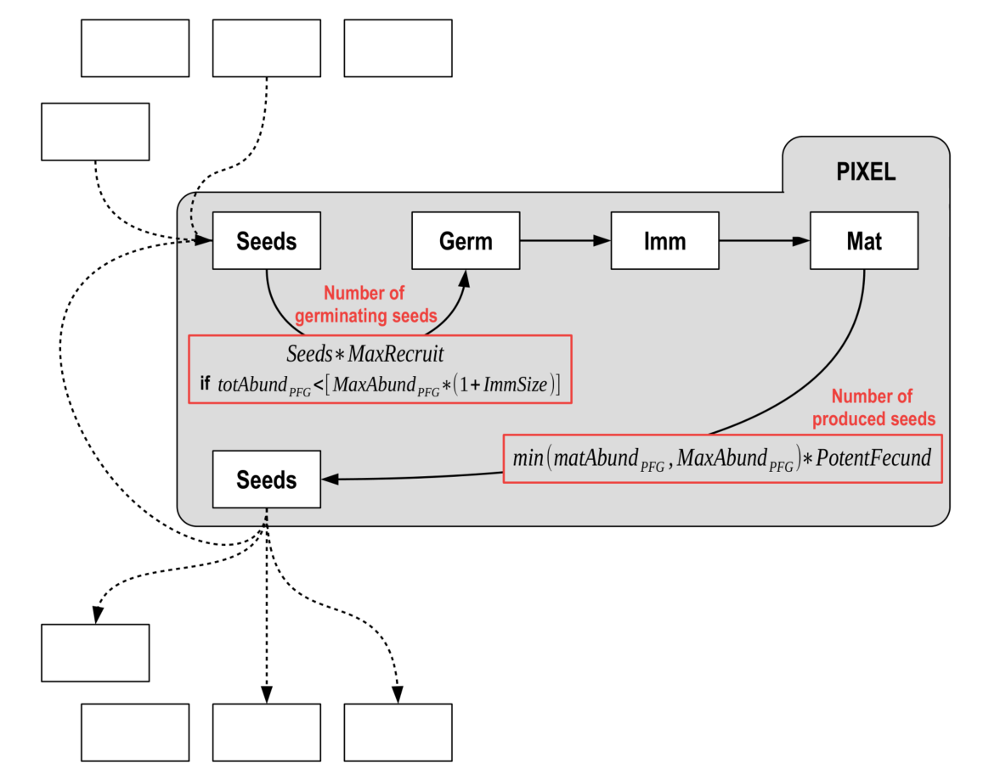

See [Boulangeat, 2014](papers/Boulangeat_2014_Global_Change_Biology.pdf "Boulangeat, I., Georges, D., Thuiller, W., FATE-HD: A spatially and temporally explicit integrated model for predicting vegetation structure and diversity at regional scale. Global Change Biology, 20, 2368–2378.") or the [Publications](fate_tutorial_0_publications.html) page

  

## <i class="fas fa-boxes"></i> Conceptual diagram

The whole area is divided in grid-cells in which an independent **demographic model** regulates the PFG life cycle. PFG abundances are structured by age into cohorts and each cohort is attributed to a height stratum according to the growth parameters.

Different submodels affect this cycle at various levels :

- **Competition through <i class="fas fa-sun"></i> light and/or <i class="fas fa-recycle"></i> soil resources** regulates interactions between cohorts affecting germination, recruitment and survival.

- **<i class="fas fa-globe"></i> Habitat suitability** affects the recruitment and fecundity rates.

- **<i class="fas fa-seedling"></i> The seed dispersal model** makes `FATE` spatially explicit by connecting grid-cells.  
It depends on the amount of seeds produced by mature plants and affects each PFG’s seed bank in each cell.

- **<i class="fas fa-bolt"></i> Disturbances** affect PFG survival and fecundity.

 

</img>

  

## <i class="fas fa-recycle"></i> Life cycle of each PFG and influences from sub-models

Only three age classes are considered : **germinant**, **juvenile** and **mature**.

- The **recruitment** is influenced by the habitat suitability and the biotic interactions.
- **Mortality** occurs when light or soil conditions are not favorable or when the PFG completes its life span.
- In addition, the disturbance regime directly affects juvenile or mature PFG and may for instance result in PFG death, impede **seed production** by reducing mature PFG age to N-1, or **revitalize senescents** by reducing their age to M-1.

 

</img>

</img>

<!-- </img> -->
<!-- </img> -->

  

## <i class="fas fa-square-root-alt"></i> Structural equations

 

**Influence of environment (habitat suitability) :**  

- **getEnv...() functions** :  
All the $\text{getEnv}...()$ functions represent the influence of the habitat suitability if the `SuFateh` model is selected.  
They can have effect on different processes, such as mortality, recruitment or fecundity, depending on whether the habitat within the pixel is suitable or not for the considered PFG.
  
 

- **Is the habitat suitable ?** :  
Each year (timestep), the values contained in each PFG habitat suitability maps will be compared to a reference value :

  - if superior, the environment is considered suitable for the PFG (hence $\text{getEnv}...()$ functions will return `1`)
  - otherwise, the environment is considered unsuitable for the PFG (hence $\text{getEnv}...()$ functions will return `0`)

Depending on the parameterisation chosen, (see `HABSUIT_OPTION` parameter in [GlobalParameter](reference/PRE_FATE.params_globalParameters.html) file), the reference value can be set in two different ways.

 

**Lifespan & maturity :**  

- **Lifespan** :  
In theory, the lifetime of a species could be influenced by the environment, but this is currently not the case.  
Hence, habitat or not, $\text{getEnvMort}() = 1$.

$$\text{LifeSpan} * \text{getEnvMort}()$$
 

- **Maturity time** :  
The time from which a PFG is able to produce seeds can also be influenced by its habitat, in a negative way :

\begin{align}
\text{maturityTime} &= (\text{LifeSpan} - \text{Maturity}) * (1.0 - \text{getEnvGrowth}()) + \text{Maturity} \\
\text{maturityTime} &= ceil(\text{maturityTime})
\end{align}

If `SuFateh` model is NOT selected, or the habitat is suitable, then $\text{maturityTime} = \text{Maturity}$.  
Otherwise, it the habitat is NOT suitable, $\text{maturityTime} = \text{LifeSpan}$, which means there will be no fecundity, and then no seeds produced.

 

- **Maturity duration** :  
The period during which a PFG can produce seeds.

$$\text{Lifespan} - \text{Maturity}$$
 

**Carrying capacity (mature vs immature) :**  

- **Immature** :  
Depending on the PFG life-form (herbaceous, chamaephytes, phanerophytes), immature individuals may no take as much space as mature individuals (e.g. young tree vs old tree). Hence, when calculating total abundance of plants, which is used as a proxy of space occupation, abundance of immature individuals is weighted by their relative size compare to mature individuals : $\text{ImmSize}$ (see `IMM_SIZE` parameter in [Succession](reference/PRE_FATE.params_PFGsuccession.html) files).

 

- **Mature - Global carrying capacity** :  
$\text{MaxAbund} \in {1,2,3}$ defines the maximum space occupied by a mature PFG. It should be proportional to the number of strata the PFG can occupy, with taller PFG generally occupying more space (see `MAX_ABUNDANCE` parameter in [Succession](reference/PRE_FATE.params_PFGsuccession.html) files and `MAX_ABUND_{...}` parameters in [GlobalParameter](reference/PRE_FATE.params_globalParameters.html) file).

 

- **Mature - Annual carrying capacity** :  
Hence, the maximum space occupied by a mature PFG per year of maturity is defined by :

$$\frac{\text{MaxAbund}}{\text{Lifespan} - \text{Maturity}}$$

 

</img>

 

**Germination :**  

- **Condition on carrying capacity** :  
A condition is set to help regulate populations : new individuals only grow if there is not yet too many individuals within the pixel, i.e. if the total abundance of the PFG does not exceed its global carrying capacity :

\begin{align}
\text{totAbund} &= \text{AbundMature} &+ \text{AbundImmature} * \text{ImmSize} \\
\text{globalCC} &= \text{MaxAbund} &+ \text{MaxAbund} * \text{ImmSize}\\
&\text{if (totAbund} < \text{globalCC)} \\
&\{ \\
& ... \\
&\}
\end{align}

 

- **Condition on pixel resources** :  
$MaxRecruit$ corresponds to percentage of seeds that will germinate depending on the pixel resources (light, soil) in stratum 0 (which represents the enforced dormancy) (see `ACTIVE_GERM` parameter in [Light](reference/PRE_FATE.params_PFGlight.html) and [Soil](reference/PRE_FATE.params_PFGsoil.html) files).  
The number of germinating seeds is obtained by weighting the number of available seeds by this germination rate.  
If `SuFateh` model is selected, the habitat must be suitable, otherwise the recruitment will be null.

\begin{align}
\text{RecruitmentRate} &= \text{GerminationRate} &* \text{ getEnvRecrRate}() \\
 &= \text{AvailSeeds} * \text{MaxRecruitment} &* \text{ getEnvRecrRate}() 
\end{align}

 

**Fecundity :**  

- **Potential fecundity** :  
Each PFG can produce a fixed maximum amount of seeds in optimal conditions (see `POTENTIAL_FECUNDITY` parameter in [Succession](reference/PRE_FATE.params_PFGsuccession.html) files). Due to lack of empirical data, this amount is often set at the same value for all PFG.

 

- **Produced seeds** :  
At each time step, the number of seeds that will be produced by a PFG depends both on the number of mature individuals of this PFG within the considered pixel, and on the suitability of the pixel if the `SuFateh` model is selected (no seeds produced if the habitat is not suitable) :

$$\text{Fecundity} = min(1, \frac{\text{AbundMature}}{\frac{\text{MaxAbund}}{\text{Lifespan} - \text{Maturity}}}) * \text{PotentialFecund} * \text{getEnvFecund}()$$

If $\frac{\text{AbundMature}}{\frac{\text{MaxAbund}}{\text{Lifespan} - \text{Maturity}}} \geqslant 1$, the PFG has reached its annual carrying capacity : it is in optimal conditions and will produce its maximum amount of seeds ($\text{PotentialFecund}$). Otherwise, this amount will be reduced in proportion.

