## <i class="fa fa-battery-quarter"></i> Origins (FATE / LAMOS / BioMove)

 

<a href="papers/Moore_Noble_1990_JEM.pdf" class="download" title="Download as PDF">
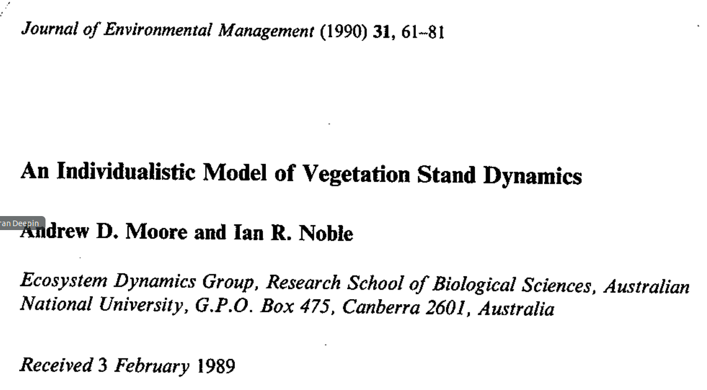
</a>
<!-- <a href="papers/Lavorel_2000_Workshop.pdf" class="download" title="Download as PDF"> -->
<!--  -->
<!-- </a> -->
<a href="papers/Midgley_2010_Ecography.pdf" class="download" title="Download as PDF">
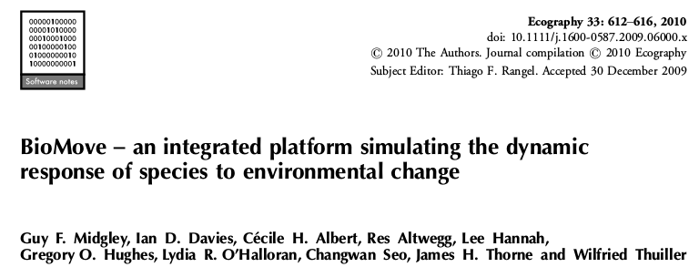
</a>

 

- **Moore** A. D. and Noble I. R. (**1990**), *An individualistic model of vegetation stand dynamics*. https://doi.org/10.1016/s0301-4797(05)80015-5

- **Lavorel** S., Davies I. D. and Noble I. R. (**2000**). *LAMOS: a landscape modelling shell*. Landscape Fire Modeling-Challenges and Opportunities. Natural Resources Canada, Canadian Forest Service, Vancouver, BC, Canada, 25-28.

- **Midgley** G. F., Davies I. D., Albert C. H., Altwegg R., Hannah L., Hughes G. O., O'Halloran L. R., Seo C., Thorne J. H. and Thuiller W. (**2010**), *BioMove – an integrated platform simulating the dynamic response of species to environmental change*. Ecography, 33: 612-616. https://doi.org/10.1111/j.1600-0587.2009.06000.x

  
___________________________________________________________________________________________________

___________________________________________________________________________________________________

## <i class="fa fa-battery-half"></i> FATE model

 

<a href="papers/Boulangeat_2012_Global_Change_Biology.pdf" class="download" title="Download as PDF">
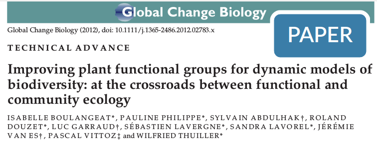
</a>
<a href="papers/Boulangeat_2012_Global_Change_Biology_SupMat.pdf" class="download" title="Download as PDF">
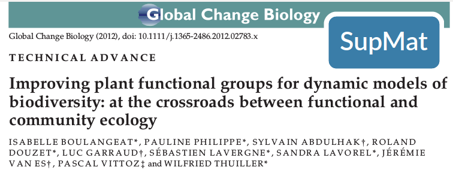
</a>

<a href="papers/Boulangeat_2014_Global_Change_Biology_SupMat.pdf" class="download" title="Download as PDF">
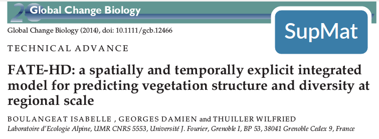
</a>

 

- **Boulangeat** I., Philippe P., Abdulhak S., Douzet R., Garraud L., Lavergne S., Lavorel S., Van Es J., Vittoz P. and Thuiller W. (**2012**), *Improving plant functional groups for dynamic models of biodiversity: at the crossroads between functional and community ecology*. Glob Change Biol, 18: 3464-3475. https://doi.org/10.1111/j.1365-2486.2012.02783.x

- **Boulangeat** I., Georges D. and Thuiller W. (**2014**), *FATE‐HD: a spatially and temporally explicit integrated model for predicting vegetation structure and diversity at regional scale*. Glob Change Biol, 20: 2368-2378. https://doi.org/10.1111/gcb.12466

  
___________________________________________________________________________________________________

___________________________________________________________________________________________________

## <i class="fa fa-battery-three-quarters"></i> Applications

 

<a href="papers/Boulangeat_2014_Ecography.pdf" class="download" title="Download as PDF">
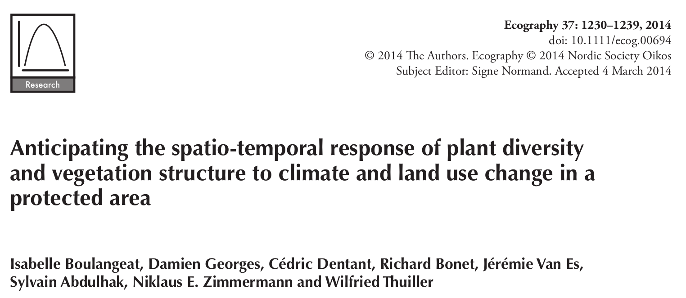
</a>

<a href="papers/Barros_2016_Ecology_Letters_SupMat1.docx" class="download" title="Download as PDF">
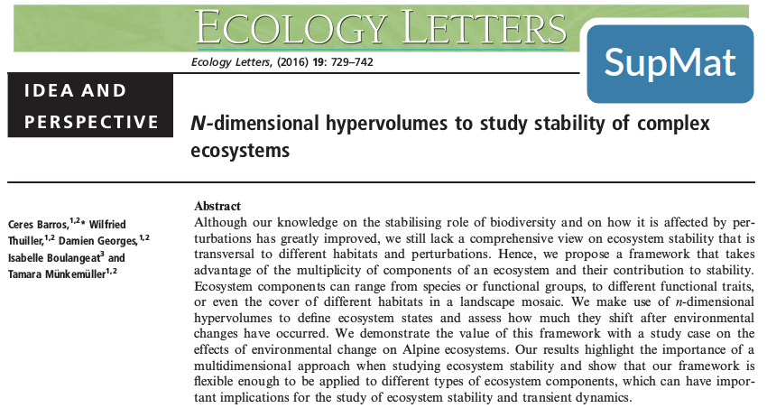
</a>
<a href="papers/Barros_2017_Journal_Applied_Ecology.pdf" class="download" title="Download as PDF">
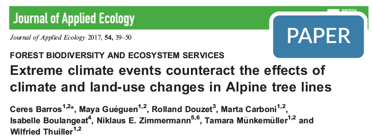
</a>
<a href="papers/Barros_2017_Journal_Applied_Ecology_SupMat.7z" class="download" title="Download as PDF">
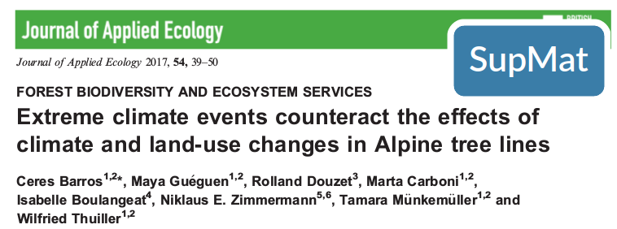
</a>
<a href="papers/Carboni_2017_Global_Change_Biology.pdf" class="download" title="Download as PDF">
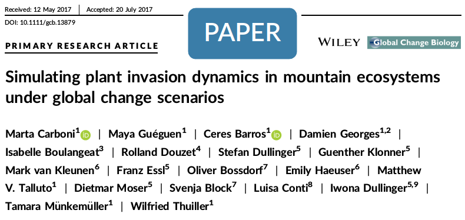
</a>
<a href="papers/Carboni_2017_Global_Change_Biology_SupMat.pdf" class="download" title="Download as PDF">
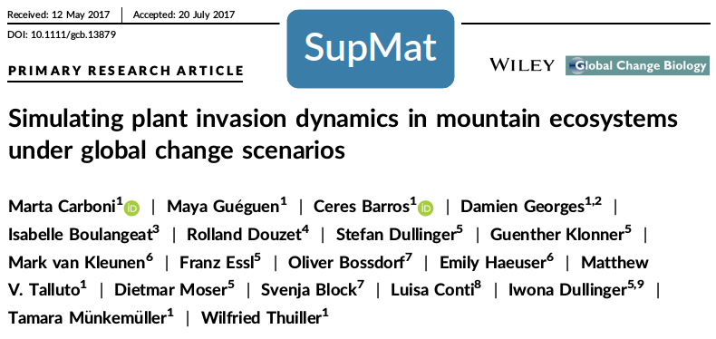
</a>
<a href="papers/Thuiller_2017_Diversity_Distributions.pdf" class="download" title="Download as PDF">
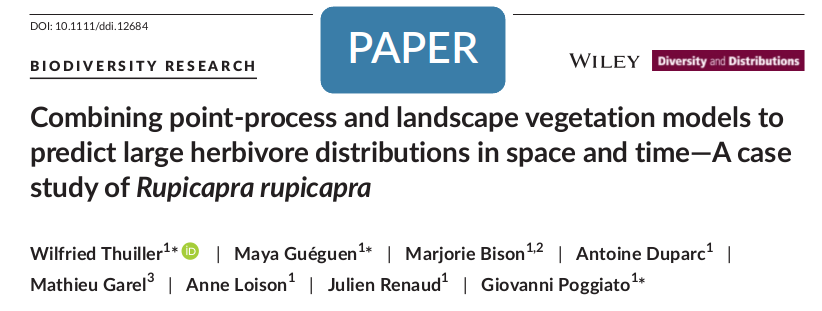
</a>
<a href="papers/Thuiller_2017_Diversity_Distributions_SupMat.docx" class="download" title="Download as PDF">
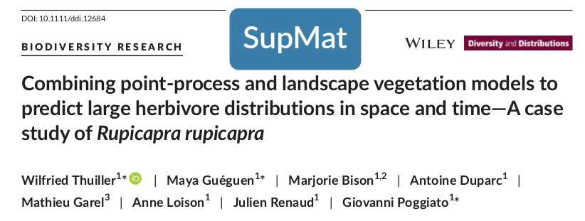
</a>

 

- **Boulangeat** I., Georges D., Dentant C., Bonet R., Van Es J., Abdulhak S., Zimmermann N. E. and Thuiller W. (**2014**), *Anticipating the spatio‐temporal response of plant diversity and vegetation structure to climate and land use change in a protected area*. Ecography, 37: 1230-1239. https://doi:10.1111/ecog.00694

- **Barros** C., Thuiller W., Georges D., Boulangeat I., Münkemüller T. and Bellwood D. (**2016**), *N‐dimensional hypervolumes to study stability of complex ecosystems*. Ecol Lett, 19: 729-742. https://doi.org/10.1111/ele.12617

- **Barros** C., Guéguen M., Douzet R., Carboni M., Boulangeat I., Zimmermann N. E., Münkemüller T., Thuiller W. and Mori A. (**2017**), *Extreme climate events counteract the effects of climate and land‐use changes in Alpine tree lines*. J Appl Ecol, 54: 39-50. https://doi.org/10.1111/1365-2664.12742

- **Carboni** M., Guéguen M., Barros C., Georges D., Boulangeat I., Douzet R., Klonner G., Van Kleunen M., Essl F., Bossdorf O., Haeuser E., Talluto M. V., Moser D., Block S., Conti L., Dullinger I., Münkemüller T. and Thuiller W. (**2018**). *Simulating plant invasion dynamics in mountain ecosystems under global change scenarios*. Glob Change Biol, 24:e289–e302. https://doi.org/10.1111/gcb.13879

- **Thuiller** W, Guéguen M, Bison M, et al (**2018**). *Combining point‐process and landscape vegetation models to predict large herbivore distributions in space and time—A case study of Rupicapra rupicapra*. Divers Distrib, 24:352–362. https://doi.org/10.1111/ddi.12684

