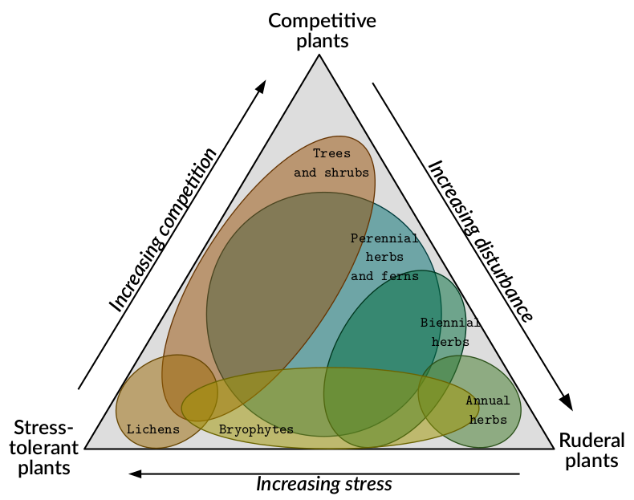
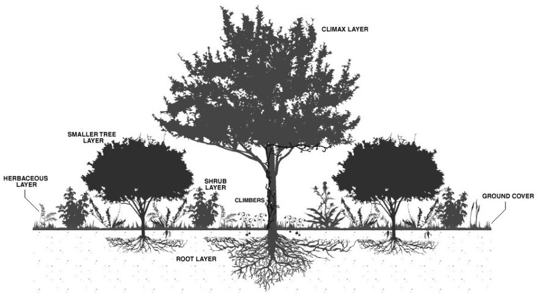
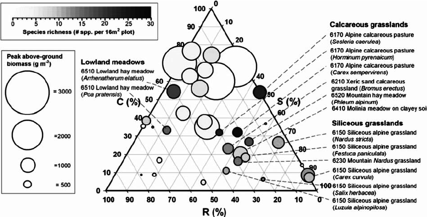
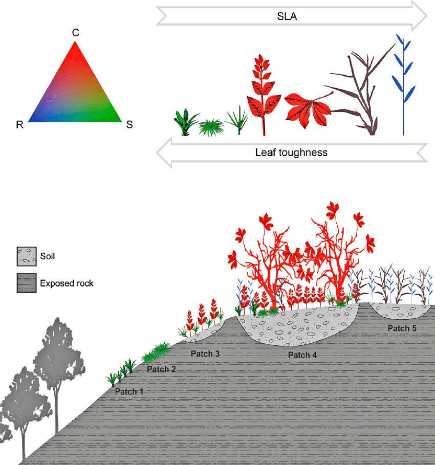

<link rel="stylesheet" href="https://use.fontawesome.com/releases/v5.0.13/css/all.css" integrity="sha384-DNOHZ68U8hZfKXOrtjWvjxusGo9WQnrNx2sqG0tfsghAvtVlRW3tvkXWZh58N9jp" crossorigin="anonymous">

  

"*The recurring suggestions are that models should explicitly (i) include spatiotemporal dynamics; (ii) consider
multiple species in interactions and (iii) account for the processes shaping biodiversity distribution.*"

`FATE` is a "*a biodiversity model that meets this challenge at regional scale by combining phenomenological and process-based approaches and using well-defined **plant functional group**. *" ([Boulangeat, 2014](http://www.will.chez-alice.fr/pdf/BoulangeatGCB2014.pdf "Boulangeat, I., Georges, D., Thuiller, W., FATE-HD: A spatially and temporally explicit integrated model for predicting vegetation structure and diversity at regional scale. Global Change Biology, 20, 2368–2378."))

  

## <i class="fas fa-ruler"></i> Characteristics of a plant functional group ?

 

A plant functional group, or **PFG**, is "*a set of representative species [that] is classified based on **key biological characteristics**, to determine groups of species* **_sharing_ _ecological_ _strategies_**." ([Boulangeat, 2012](http://j.boulangeat.free.fr/pdfs/Boulangeat2012_GCB_published.pdf "Boulangeat, I., Philippe, P., Abdulhak, S., Douzet, R., Garraud, L., Lavergne, S., Lavorel, S., Van Es J., Vittoz, P. and Thuiller, W. Improving plant functional groups for dynamic models of biodiversity: at the crossroad between functional and community ecology. Global Change Biology, 18, 3464-3475."))

</img>

</img>

 

"**_Dominant_ _species_** *are usually seen as the main drivers of vegetation dynamics and ecosystem functioning (‘Biomass ratio hypothesis’ (Grime, 1998). Moreover, according to the well-known species-abundance distribution (Whittaker, 1965), just a few species produce most of the community’s biomass. **In each vegetation strata (herbaceous, shrub, trees)**, these species are the most important, not only for structuring the landscape, but also explaining patterns of functional diversity.*" ([Boulangeat, 2012](http://j.boulangeat.free.fr/pdfs/Boulangeat2012_GCB_published.pdf "Boulangeat, I., Philippe, P., Abdulhak, S., Douzet, R., Garraud, L., Lavergne, S., Lavorel, S., Van Es J., Vittoz, P. and Thuiller, W. Improving plant functional groups for dynamic models of biodiversity: at the crossroad between functional and community ecology. Global Change Biology, 18, 3464-3475."))

 

</img>
<figcaption>Fig4. [Cerabolini, 2014](https://doi.org/10.1080/11263504.2014.987848 "Cerabolini, Bruno & Pierce, Simon & Verginella, A. & Brusa, Guido & Ceriani, R. & Armiraglio, Stefano. (2014). Why are many anthropogenic agroecosystems particularly species-rich?. Plant Biosystems.")</figcaption>

  

Building Plant Functional Group therefore consists of bringing together plants that have similar traits and strategies. Emphasis is placed on dominant plants that are supposed to structure the community, and groups are formed according to vegetation strata (and thus height). Soil conditions can also be taken into account (through trait measurement), as well as environmental or climatic conditions (through niche overlap).

</img>
<figcaption>Fig4. [de Paula, 2015](https://doi.org/10.1007/s10531-015-0904-x "F. A. de Paula, Luiza & Negreiros, Daniel & Azevedo, Luísa & Fernandes, Renato & Stehmann, Joao & Silveira, Fernando. (2015). Functional ecology as a missing link for conservation of a resource-limited flora in the Atlantic forest. Biodiversity and Conservation. 24. 2239-2253.")</figcaption>

  

## <i class="fa fa-shoe-prints"></i> What are the key steps of this process ?

 

Since the basic idea of building Functional Group is to gather a lot of elements into a few, this implies two requirements :

- that these elements are not too numerous
- and that they are representative of the studied area, meaning not rare or outlier elements.  
**This is the first step : the selection of dominant species.**

In order to identify similarities between selected dominant species in terms of habitat, the climatic or environmental niche of each species is calculated and is compared with all the other dominant species niches.  
**The overlap of species climatic niches is obtained in second step.**

Functional traits related to the fundamental process of growth are retrieved for each dominant species and mixed together to calculate functional distances between species.  
**Overlap of climatic niches and functional distances are combined to form a matrix of species pairwise distances.**

Finally, based on this distance matrix, **species are clustered to find the best combination and obtain Functional Groups.**

  

See [Build PFG](rfate_tutorial_1_PFG.html) `RFate` tutorial

