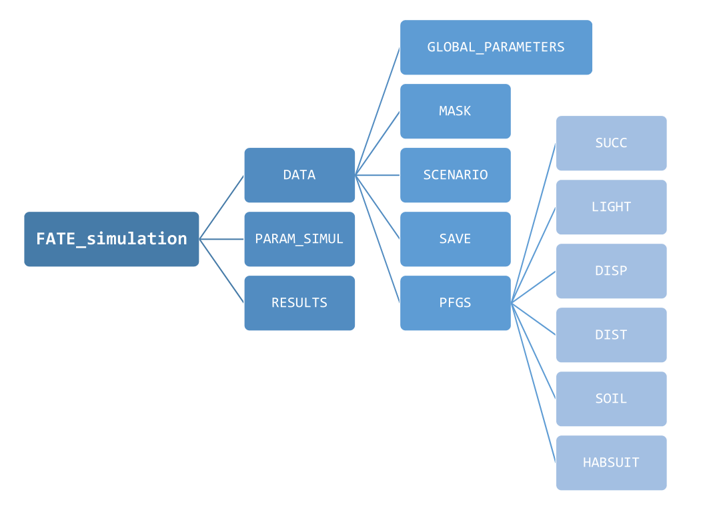

<link rel="stylesheet" href="https://use.fontawesome.com/releases/v5.0.13/css/all.css" integrity="sha384-DNOHZ68U8hZfKXOrtjWvjxusGo9WQnrNx2sqG0tfsghAvtVlRW3tvkXWZh58N9jp" crossorigin="anonymous">

   

"*The recurring suggestions are that models should explicitly (i) include spatiotemporal dynamics; (ii) consider
multiple species in interactions and (iii) account for the processes shaping biodiversity distribution.*"

`FATE` is a "*a biodiversity model that meets this challenge at regional scale by combining phenomenological and process-based approaches and using well-defined plant functional group*". ([Boulangeat, 2014](papers/Boulangeat_2014_GCB.pdf "Boulangeat, I., Georges, D., Thuiller, W., FATE-HD: A spatially and temporally explicit integrated model for predicting vegetation structure and diversity at regional scale. Global Change Biology, 20, 2368–2378."))

   

# What FATE needs to be run?

 

### <i class="fa fa-copy"></i> The different type of parameters and *flags*

`FATE` requires a quite large number of parameters, which are stored into `.txt` files, presented to and recovered by the software. These **parameters** can be of 3 types :

1. **Filenames**, to guide the application to other parameter files that should be read
2. These filenames either correspond to :
    - other parameter files that contain **values** to be actually read and used
    - **raster** files, with the extension `.tif` (lighter) or `.img`

 

### <i class="fas fa-wrench"></i> How to produce all these parameters files ?

[RFate](https://mayagueguen.github.io/RFate/) is a [R](https://www.r-project.org/) package available on [github](https://github.com/MayaGueguen/RFate) and designed to provide support function to the `FATE` software.

It contains documentation and functions to create and organize all input files required by the model, as well as scripts to help analyze the resulting outputs.

 

See [Build parameter files](rfate_tutorial_2_params.html) `RFate` tutorial

 

### <i class="fas fa-folder-open"></i> The FATE friendly directory organization

As `FATE` needs quite a lot of parameters given into different parameter files, it is important to organize them in a clear and intuitive way.

While this is not mandatory to run a `FATE` simulation, a specific and methodical folder architecture can be obtained with the [PRE_FATE.skeletonDirectory function](../reference/PRE_FATE.skeletonDirectory.html) from the [RFate](https://mayagueguen.github.io/RFate/) package.

A good way to start is to create this skeleton directory, and then copy or create the needed files inside to have all simulation data into the same place.

{width=65%}

   

# How to run a FATE Simulation ?

 

When all data and parameter files have been produced and correctly referred in a [SimulParameters](../reference/PRE_FATE.params_simulParameters.html) file, a `FATE` simulation can be run using the [FATE.run](../reference/FATE.run.html) function : 

- the simulation will start, and the software will print messages into the console indicating what the software is doing.
- depending on the simulation duration, the size and the resolution of the study area, the number of Plant Functional Groups (PFG) involved, ... running the full simulation **could take a while**.

 

**Note :** the folder from which the command is sent must be adapted based on how paths to files have been given within the [SimulParameters](../reference/PRE_FATE.params_simulParameters.html) file :

- If all paths are **absolute**  
(i.e. including the root, such as *`/home/username/FATE_simulation/DATA/GLOBAL_PARAMETERS/Global_parameters_V1.txt`*),  
there should not be any problem.  
The only requirement then is to also give absolute path to the simulation folder, if not in the current directory.

- If all paths are **relative**  
(i.e. starting from a specific folder, such as *`FATE_simulation/DATA/GLOBAL_PARAMETERS/Global_parameters_V1.txt`*),  
then the `FATE` simulation must be run from this specific folder  
(i.e. here from the folder containing the *`FATE_simulation`* folder).

   

# How to handle the results ?

 

Once the simulation is completed, the directory defined under the flag `--SAVING_DIR--` within the [SimulParameters](../reference/PRE_FATE.params_simulParameters.html) file must contain the following directories :

- *`ABUND_allPFG_perStrata/`*
- *`ABUND_perPFG_allStrata/`*
- *`ABUND_perPFG_perStrata/`*

Each of them contains raster files with the abundance of Plant Functional Groups (PFG) (which should be considered as a proxy for the vegetation coverage/abundance) contained within each pixel of the study area. The files within each folder show different informations :

- *`ABUND_perPFG_perStrata/`* : a file represents **one specific year**, and the abundance of **a specific PFG** in **a specific stratum**
- *`ABUND_allPFG_perStrata`/* : a file represents **one specific year**, and the abundance of **all PFGs** in **a specific stratum**
- *`ABUND_perPFG_allStrata/`* : a file represents **one specific year**, and the abundance of **a specific PFG** within **all strata**

If the corresponding modules were activated within the [GlobalParameters](../reference/PRE_FATE.params_globalParameters.html) file, the following folders should also contain files :

- *`LIGHT/`*
- *`SOIL/`*

These ouputs can then be used as is, or post-treated with functions from the [RFate](https://mayagueguen.github.io/RFate/) package to obtain more specific results (e.g. evolution of abundance curves, cover or diversity maps, etc).

 

See [Build graphics](rfate_tutorial_3_graphics.html) `RFate` tutorial

