<link rel="stylesheet" href="https://use.fontawesome.com/releases/v5.0.13/css/all.css" integrity="sha384-DNOHZ68U8hZfKXOrtjWvjxusGo9WQnrNx2sqG0tfsghAvtVlRW3tvkXWZh58N9jp" crossorigin="anonymous">

<style>
.zoom p {
width:600px;
margin-left: auto;
margin-right: auto;
}
.zoom p:hover {
width:1200px;
}
</style>


<br/><br/>


## <i class="fas fa-book-medical"></i> Manual (Version 1.0.0)

<br/>

More informations about the `Champsaur` example dataset can be found [here](./../reference/dot-loadData.html).

<br/>

<div style="text-align:center;">
<embed src="RFate_v1.0_UserManual.pdf" width='800' height='600' allowfullscreen webkitallowfullscreen></embed>
</div>


<br/><br/>
<br/><br/>


## <i class="fas fa-code"></i> Complete code example

<br/>

The different parts of the `Champsaur` example dataset can be downloaded with the [.loadData](./../reference/dot-loadData.html) function, or from the links below :

|                | `RData` | `7z` |      |                |  `V1.7z`  |  `V2.7z`  |  `V3.7z`  |  `V4.7z`  |
| :------------- | :-----: | :--: | :--: | :------------- | :--: | :--: | :--: | :--: |
| **1. PFG**     | <a href="https://raw.githubusercontent.com/leca-dev/RFate/master/data-raw/Champsaur_PFG.RData" class="download" title="Download as RData"><i class="fas fa-download"></i></a> | <a href="https://raw.githubusercontent.com/leca-dev/RFate/master/data-raw/Champsaur_PFG.7z" class="download" title="Download as 7z"><i class="fas fa-download"></i></a> |  | **3. simul** | <a href="https://raw.githubusercontent.com/leca-dev/RFate/master/data-raw/Champsaur_simul_V1.7z" class="download" title="Download as 7z"><i class="fas fa-download"></i></a> | <a href="https://raw.githubusercontent.com/leca-dev/RFate/master/data-raw/Champsaur_simul_V2.7z" class="download" title="Download as 7z"><i class="fas fa-download"></i></a> | <a href="https://raw.githubusercontent.com/leca-dev/RFate/master/data-raw/Champsaur_simul_V3.7z" class="download" title="Download as 7z"><i class="fas fa-download"></i></a> | <a href="https://raw.githubusercontent.com/leca-dev/RFate/master/data-raw/Champsaur_simul_V4.7z" class="download" title="Download as 7z"><i class="fas fa-download"></i></a> |
| **2. params**  | <a href="https://raw.githubusercontent.com/leca-dev/RFate/master/data-raw/Champsaur_params.RData" class="download" title="Download as RData"><i class="fas fa-download"></i></a> | <a href="https://raw.githubusercontent.com/leca-dev/RFate/master/data-raw/Champsaur_params.7z" class="download" title="Download as 7z"><i class="fas fa-download"></i></a> |  | **4. results** | <a href="https://raw.githubusercontent.com/leca-dev/RFate/master/data-raw/Champsaur_results_V1.7z" class="download" title="Download as 7z"><i class="fas fa-download"></i></a> | <a href="https://raw.githubusercontent.com/leca-dev/RFate/master/data-raw/Champsaur_results_V2.7z" class="download" title="Download as 7z"><i class="fas fa-download"></i></a> | <a href="https://raw.githubusercontent.com/leca-dev/RFate/master/data-raw/Champsaur_results_V3.7z" class="download" title="Download as 7z"><i class="fas fa-download"></i></a> | <a href="https://raw.githubusercontent.com/leca-dev/RFate/master/data-raw/Champsaur_results_V4.7z" class="download" title="Download as 7z"><i class="fas fa-download"></i></a> |


### 1. Building Plant Functional Group

```R
library(RFate)

Champsaur_PFG = .loadData("Champsaur_PFG", "RData")


###################################################################################################
## DOMINANT SPECIES
###################################################################################################

## Species observations
tab.occ = Champsaur_PFG$sp.observations
str(tab.occ)

## Run selection ----------------------------------------------------------------------------------
sp.SELECT = PRE_FATE.selectDominant(mat.observations = tab.occ[, c("sites", "species", "abund")]
                                    , doRuleA = TRUE
                                    , rule.A1 = 10
                                    , rule.A2_quantile = 0.88
                                    , doRuleB = TRUE
                                    , rule.B1_percentage = 0.25
                                    , rule.B1_number = 10
                                    , rule.B2 = 0.5
                                    , doRuleC = FALSE
                                    , opt.doRobustness = TRUE
                                    , opt.robustness_percent = seq(0.1, 0.9, 0.1)
                                    , opt.robustness_rep = 10
                                    , opt.doSitesSpecies = TRUE
                                    , opt.doPlot = TRUE)

## Explore results
names(sp.SELECT)
str(sp.SELECT[1:5])
str(sp.SELECT$tab.rules)
plot(sp.SELECT$plot.A)
plot(sp.SELECT$plot.B$abs)
plot(sp.SELECT$plot.B$rel)
plot(sp.SELECT$plot.pco$Axis1_Axis2)
# plot(sp.SELECT$plot.pco$Axis1_Axis3)
str(sp.SELECT$tab.robustness)
names(sp.SELECT$plot.robustness)
plot(sp.SELECT$plot.robustness$`All dataset`)


## Prepare data to calculate pairwise species distance --------------------------------------------

# ## Calculate mat.overlap matrix
# ## Add absences in community sites
# tab.dom.PA = sp.SELECT$tab.dom.PA
# for (si in tab.occ$sites[which(tab.occ$TYPE == "COMMUNITY")])
# {
#   ind = which(rownames(tab.dom.PA) == si)
#   tab.dom.PA[ind, which(is.na(tab.dom.PA[ind, ]))] = 0
# }
# 
# ## Prepare environmental (and traits) table
# tab.env = Champsaur_PFG$tab.env
# tmp.traits = Champsaur_PFG$sp.traits[, c("species", "HEIGHT", "HEIGHT_log")]
# sp.DIST = PRE_FATE.speciesDistance(mat.traits = tmp.traits
#                                    , mat.overlap.option = "PCA"
#                                    , mat.overlap.object = list(tab.dom.PA, tab.env))
# mat.overlap = sp.DIST$mat.OVERLAP
# (mat.overlap[1:5, 1:5])


## Transform dissimilarity matrices into similarity distances
mat.habitat = Champsaur_PFG$mat.habitat
mat.overlap = Champsaur_PFG$mat.overlap

mat.habitat = 1 - mat.habitat
mat.overlap = 1 - mat.overlap


## Load selected traits for each group
tab.traits.P = Champsaur_PFG$sp.traits.P
tab.traits.C = Champsaur_PFG$sp.traits.C
tab.traits.H = Champsaur_PFG$sp.traits.H

str(tab.traits.P)
str(tab.traits.C)
str(tab.traits.H)
  


###################################################################################################
## PHANEROPHYTE
###################################################################################################

## Calculate pairwise species distance ------------------------------------------------------------
sp.DIST.P = PRE_FATE.speciesDistance(mat.traits = tab.traits.P
                                     , mat.overlap.option = "dist"
                                     , mat.overlap.object = mat.habitat
                                     , opt.weights = c(0.5, 0.5)
                                     , opt.maxPercent.NA = 0.25
                                     , opt.maxPercent.similarSpecies = 0.5
                                     , opt.min.sd = 0.5)
str(sp.DIST.P)
{
  require(foreach)
  require(ggplot2)
  require(ggdendro)
  pp = foreach(x = names(sp.DIST)) %do%
  {
    hc = hclust(as.dist(sp.DIST[[x]]))
    pp = ggdendrogram(hc, rotate = TRUE) +
      labs(title = paste0("Hierarchical clustering based on species distance "
                          , ifelse(length(names(sp.DIST)) > 1
                          , paste0("(group ", x, ")")
                          , "")))
    return(pp)
  }
  plot(pp[[1]])
  plot(pp[[2]])
  plot(pp[[3]])
}
                                     
## Build clusters and choose final groups number --------------------------------------------------
sp.CLUST1.P = PRE_FATE.speciesClustering_step1(sp.DIST.P$mat.ALL)
sp.CLUST2.P = PRE_FATE.speciesClustering_step2(clust.dendrograms = sp.CLUST1.P$clust.dendrograms
                                               , no.clusters = 5
                                               , mat.species.DIST = sp.DIST.P$mat.ALL)
names(sp.CLUST2.P)
str(sp.CLUST2.P$determ.sp)
str(sp.CLUST2.P$determ.all)
plot(sp.CLUST2.P$plot.distance)
plot(sp.CLUST2.P$plot.PCO$GROUP1)


###################################################################################################
## CHAMAEPHYTE
###################################################################################################

## Combine distances of habitat preferences and niche overlap
## to have one matrix to reflect the species niches
wei.habi = 0.5
wei.over = 0.5
ind.sp = intersect(colnames(mat.overlap), colnames(mat.habitat))
mat.env = (wei.habi * mat.habitat[ind.sp, ind.sp] + wei.over * mat.overlap[ind.sp, ind.sp]) / (wei.habi + wei.over)

(mat.habitat[ind.sp, ind.sp][1:5, 1:5])
(mat.overlap[ind.sp, ind.sp][1:5, 1:5])
(mat.env[1:5, 1:5])

## Calculate pairwise species distance ------------------------------------------------------------
sp.DIST.C = PRE_FATE.speciesDistance(mat.traits = tab.traits.C
                                     , mat.overlap.option = "dist"
                                     , mat.overlap.object = mat.env
                                     , opt.weights = c(0.4, 0.6)
                                     , opt.maxPercent.NA = 0.25
                                     , opt.maxPercent.similarSpecies = 0.5
                                     , opt.min.sd = 0.5)

## Build clusters and choose final groups number --------------------------------------------------
sp.CLUST1.C = PRE_FATE.speciesClustering_step1(sp.DIST.C$mat.ALL)
sp.CLUST2.C = PRE_FATE.speciesClustering_step2(clust.dendrograms = sp.CLUST1.C$clust.dendrograms
                                               , no.clusters = 4
                                               , mat.species.DIST = sp.DIST.C$mat.ALL)


###################################################################################################
## HERBACEOUS
###################################################################################################

## Rearrange data (more difficult to distinguish groups among herbaceous species) -----------------

## Separate some species quite different from the rest
SP_wetlands = c("15735", "15211", "10429", "17167", "40501", "16522", "40514", "14782", "40445", "14316")
SP_outliers = c("11223", "5445", "14024", "11035", "10477")
tab.traits.H = tab.traits.H[-which(tab.traits.H$species %in% SP_wetlands), ]
tab.traits.H = tab.traits.H[-which(tab.traits.H$species %in% SP_outliers), ]
  
## Put more weights on overlap matrix
wei.habi = 0.4
wei.over = 0.6
ind.sp = intersect(colnames(mat.overlap), colnames(mat.habitat))
mat.env = (wei.habi * mat.habitat[ind.sp, ind.sp] + wei.over * mat.overlap[ind.sp, ind.sp]) / (wei.habi + wei.over)

(mat.habitat[ind.sp, ind.sp][1:5, 1:5])
(mat.overlap[ind.sp, ind.sp][1:5, 1:5])
(mat.env[1:5, 1:5])

## Calculate pairwise species distance ------------------------------------------------------------
sp.DIST.H = PRE_FATE.speciesDistance(mat.traits = tab.traits.H
                                     , mat.overlap.option = "dist"
                                     , mat.overlap.object = mat.env
                                     , opt.weights = c(0, 1)
                                     , opt.maxPercent.NA = 0.25
                                     , opt.maxPercent.similarSpecies = 0.5
                                     , opt.min.sd = 0.5)
                                     
                                     
## Build clusters and choose final groups number --------------------------------------------------
sp.CLUST1.H = PRE_FATE.speciesClustering_step1(sp.DIST.H$mat.ALL)
sp.CLUST2.H = PRE_FATE.speciesClustering_step2(clust.dendrograms = sp.CLUST1.H$clust.dendrograms
                                               , no.clusters = 7
                                               , mat.species.DIST = sp.DIST.H$mat.ALL)

## Groups H6 (adventices) and H7 (outlier species) will be removed
## SP_wetlands will become PFG H6


###################################################################################################
## PLANT FUNCTIONAL GROUPS
###################################################################################################

tab.PFG = Champsaur_PFG$PFG.species
tab.PFG = tab.PFG[which(tab.PFG$DETERMINANT == "TRUE"), ]

tab.traits = Champsaur_PFG$sp.traits
tab.summary = tab.traits[, c("species", "MATURITY", "LONGEVITY", "HEIGHT", "LIGHT"
                             , "DISPERSAL", "NITROGEN", "NITROGEN_TOLERANCE", "LDMC", "LNC")]
colnames(tab.summary) = c("species", "maturity", "longevity", "height", "light"
                          , "dispersal", "soil_contrib", "soil_tolerance", "LDMC", "LNC")
tab.summary$soil_contrib = as.numeric(tab.summary$soil_contrib)
tab.summary$soil_tolerance = ifelse(tab.summary$soil_tolerance == 1, 0.5, 1)
tab.summary = merge(tab.PFG[, c("PFG", "species")], tab.summary, by = "species", all.x = TRUE)
tab.summary$soil_tolerance[which(tab.summary$PFG %in% c("H2", "P2") & tab.summary$soil_tolerance == 0.5)] = 1
head(tab.summary)

tab.dom.PA = as.data.frame(Champsaur_PFG$tab.dom.PA)
tab.dom.PA = tab.dom.PA[, which(colnames(tab.dom.PA) %in% tab.summary$species)]

## Calculate trait values per PFG -----------------------------------------------------------------

PFG.traits = PRE_FATE.speciesClustering_step3(mat.traits = tab.summary, opt.mat.PA = tab.dom.PA)

```

<br/><br/>

**Traits** used to build functional groups should *reflect the community strategies* that are taken into account in `FATE`, such as :

- life cycle (through maturity, longevity...)
- strategy for dispersal
- strategy for light (through height, light preference...)
- strategy for soil (through LNC, nitrogen, soil preference...)
- habitat and overall strategy (through LDMC, SLA, CSR strategy...)

They should be *standardized* (scale, log-transformation...) to be sure that they will all have similar importance. <br/>
Traits selected were the ones with *enough values*, and *enough variation*.

<div style="text-align:center;">
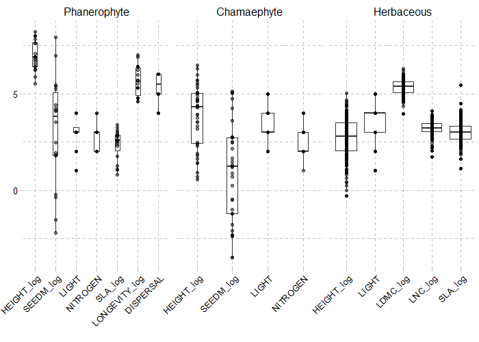</img>
</div>

<br/><br/>

A **brief description of the Plant Functional Groups obtained** for the `Champsaur` dataset is presented below. Among selected dominant species, <strike>some species</strike> have been pointed out as `Not determinant` by the [PRE_FATE.speciesClustering_step2](./../reference/PRE_FATE.speciesClustering_step2.html) function (*difference between dominant and determinant species is explained in the [Details](./../reference/PRE_FATE.speciesClustering_step2.html#details) section of this function*).

<div class="zoom">
<p>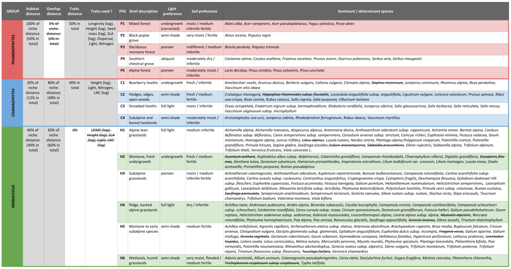</img></p>
</div>

<br/><br/>

### 2. Creating `FATE` parameter files

#### Build PFG habitat suitability maps (`biomod2` package)

```R
library(RFate)

Champsaur_params = .loadData("Champsaur_params", "RData")


###################################################################################################
## BUILD PFG HABSUIT MAPS (biomod2 package)
###################################################################################################

require(biomod2)

## Species observations
tab.occ = Champsaur_params$tab.occ
str(tab.occ)

## Sites environmental table
tab.env = Champsaur_params$tab.env
str(tab.env)

## Sites coordinates table
tab.xy = Champsaur_params$tab.xy
str(tab.xy)

## Raster stack for projection
stk.var = Champsaur_params$stk.var

## Run species distribution models ----------------------------------------------------------------

for(pfg in colnames(tab.occ))
{
  nrep = 5
  sp.name = pfg
  sp.occ = tab.occ[which(!is.na(tab.occ[, pfg])), pfg]
  sp.xy = tab.xy[which(!is.na(tab.occ[, pfg])), c("X", "Y")]
  sp.var = tab.env[which(!is.na(tab.occ[, pfg])), ]
  
  #########################################################################################
  ## BELOW, MOST CHANGES WILL BE FOR MODELS PARAMETERS OR ADAPT DATA
  ## ALL NEEDED DATA HAS BEEN PRESENTED PREVIOUSLY
  
  ## formating data in a biomod2 friendly way ------------------------------------
  bm.form <- BIOMOD_FormatingData(resp.var = as.matrix(sp.occ)
                                  , expl.var = sp.var
                                  , resp.xy = sp.xy
                                  , resp.name = sp.name)
  
  ## define models options -------------------------------------------------------
  bm.opt <- BIOMOD_ModelingOptions(GLM = list(type = "quadratic", interaction.level = 0, test = "AIC")
                                   , GAM = list(k = 3))
  
  bm.mod <- BIOMOD_Modeling(data = bm.form
                            , models = c('RF', 'GLM', 'GAM')
                            , models.options = bm.opt
                            , NbRunEval = nrep
                            , DataSplit = 70
                            , Prevalence = 0.5
                            , VarImport = 3
                            , models.eval.meth = c('TSS','ROC')
                            , do.full.models = FALSE
                            , modeling.id = 'mod1')
  
  ## run ensemble models ---------------------------------------------------------
  bm.em <- BIOMOD_EnsembleModeling(modeling.output = bm.mod
                                   , chosen.models = "all"
                                   , em.by = "all"
                                   , eval.metric = c('TSS')
                                   , eval.metric.quality.threshold = 0.4
                                   , models.eval.meth = c('TSS', 'ROC')
                                   , prob.mean = FALSE
                                   , prob.mean.weight = TRUE
                                   , prob.mean.weight.decay = 'proportional'
                                   , committee.averaging = TRUE
                                   , VarImport = 3)
  
  ## project ensemble models -----------------------------------------------------
  bm.ef <- BIOMOD_EnsembleForecasting(EM.output = bm.em
                                      , new.env = stk.var
                                      , output.format = ".img"
                                      , proj.name = "CURRENT_100m"
                                      , selected.models = "all"
                                      , binary.meth = c('TSS'))
}
```

<br/>

```R
## --------------------------------------------------------------------------------------
## This code gives a quick and rough idea of the
## PFG communities that should be found within the simulation area
## For example here :
##  H6 is mainly found with : C2 and P2 (edges, very humid and fertile groups)
##  H5 is mainly found with : P1, P3 and P4 / H2, C1 and P5 (montane and subalpine forests)

# library(phyloclim)
# type.mod = "wmean" # "ca"
# list.fi = paste0(sort(colnames(tab.occ)), "/proj_CURRENT_100m/individual_projections/"
#                  , sort(colnames(tab.occ)), "_EM", type.mod, "ByTSS_mergedAlgo_mergedRun_mergedData.img")
# stk.wmean = stack(list.fi)
# stk.wmean = stk.wmean / 1000
# names(stk.wmean) = sub("_.*", "", names(stk.wmean))
# stk.wmean[which(stk.wmean[] < 0)] = 0
# stk.wmean[which(stk.wmean[] > 1)] = 1
# HS.stk[] = ifelse(stk.wmean[] > 0.5, 1, 0)
# HS.list = lapply(1:nlayers(HS.stk), function(x) as(HS.stk[[x]], 'SpatialGridDataFrame'))
# nich = as.matrix(niche.overlap(HS.list))
# colnames(nich) = rownames(nich) = sapply(names(HS.stk), function(x) strsplit(x, "_")[[1]][2])
# library(corrplot)
# colo = colorRampPalette(c('#9e0142','#d53e4f','#f46d43','#fdae61','#fee08b','#ffffbf'
#                           ,'#e6f598','#abdda4','#66c2a5','#3288bd','#5e4fa2'))
# corrplot(nich, method = "square", type = "lower", diag = FALSE
#          , col = colo(20), cl.lim = c(0,1), order = "hclust"
#          , tl.srt = 25, tl.offset = 1)
```

<div style="text-align:center;">
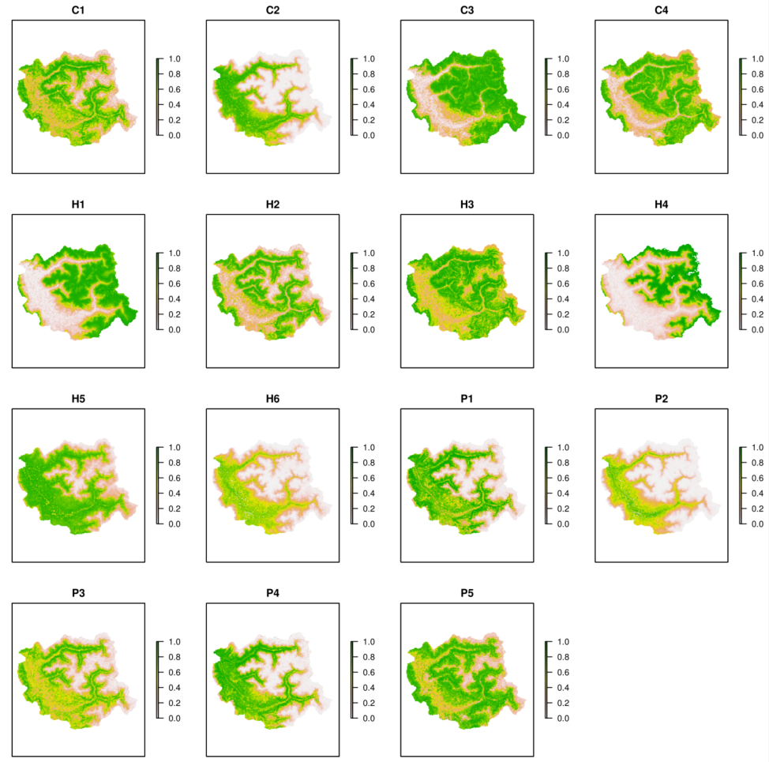</img>
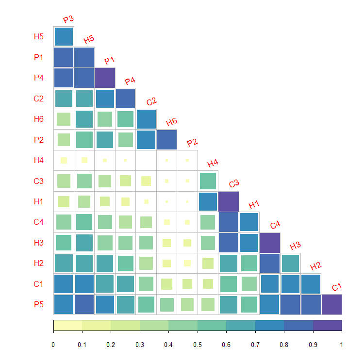</img>
</div>

<br/>

#### Create `FATE` simulation folder and parameter files


```R
library(RFate)

Champsaur_params = .loadData("Champsaur_params", "RData")

###################################################################################################
## CREATE FATE PARAMETER FOLDER
###################################################################################################

PRE_FATE.skeletonDirectory(name.simulation = "FATE_Champsaur")


## Create PFG parameter files ---------------------------------------------------------------------

## SUCCESSION ---------------------------------------------------------------------------
PRE_FATE.params_PFGsuccession(name.simulation = "FATE_Champsaur"
                              , strata.limits = c(0, 20, 50, 150, 400, 1000, 2000)
                              , strata.limits_reduce = FALSE
                              , mat.PFG.succ = Champsaur_params$tab.SUCC)


## DISPERSAL ----------------------------------------------------------------------------
# ## Load example data
# Champsaur_PFG = .loadData("Champsaur_PFG", "RData")
#
# ## Build PFG traits for dispersal
# tab.traits = Champsaur_PFG$PFG.traits
# ## Dispersal values
# ##   = Short: 0.1-2m;    Medium: 40-100m;    Long: 400-500m
# ##   = Vittoz correspondance : 1-3: Short;    4-5: Medium;   6-7:Long
# corres = data.frame(dispersal = 1:7
#                     , d50 = c(0.1, 0.5, 2, 40, 100, 400, 500)
#                     , d99 = c(1, 5, 15, 150, 500, 1500, 5000)
#                     , ldd = c(1000, 1000, 1000, 5000, 5000, 10000, 10000))
# tab.traits$d50 = corres$d50[tab.traits$dispersal]
# tab.traits$d99 = corres$d99[tab.traits$dispersal]
# tab.traits$ldd = corres$ldd[tab.traits$dispersal]
# str(tab.traits)

PRE_FATE.params_PFGdispersal(name.simulation = "FATE_Champsaur"
                             , mat.PFG.disp = Champsaur_params$tab.DISP)


## LIGHT --------------------------------------------------------------------------------
PRE_FATE.params_PFGlight(name.simulation = "FATE_Champsaur"
                         , mat.PFG.light = Champsaur_params$tab.LIGHT[, c("PFG", "type")]
                         , mat.PFG.tol = Champsaur_params$tab.LIGHT[, c("PFG", "strategy_tol")])
.setParam(params.lines = "FATE_Champsaur/DATA/PFGS/LIGHT/LIGHT_P1.txt"
          , flag = "LIGHT_TOL"
          , flag.split = " "
          , value = "1 1 0 1 1 1 1 1 1")


## SOIL ---------------------------------------------------------------------------------
PRE_FATE.params_PFGsoil(name.simulation = "FATE_Champsaur"
                        , mat.PFG.soil = Champsaur_params$tab.SOIL)


## Create simulation related parameter files ------------------------------------------------------

## SAVING YEARS -------------------------------------------------------------------------
PRE_FATE.params_savingYears(name.simulation = "FATE_Champsaur"
                            , years.maps = seq(50, 2000, 50))


## GLOBAL PARAMS ------------------------------------------------------------------------
combi = expand.grid(doLight = c(FALSE, TRUE), doSoil = c(FALSE, TRUE))
for (ii in 1:nrow(combi))
{
  PRE_FATE.params_globalParameters(name.simulation = "FATE_Champsaur"
                                   , opt.saving_abund_PFG_stratum = TRUE
                                   , opt.saving_abund_PFG = TRUE
                                   , opt.saving_abund_stratum = FALSE
                                   , required.no_PFG = 15
                                   , required.no_strata = 7
                                   , required.simul_duration = 2000
                                   , required.seeding_duration = 1000
                                   , required.seeding_timestep = 1
                                   , required.seeding_input = 100
                                   , required.potential_fecundity = 1
                                   , required.max_abund_low = 1000
                                   , required.max_abund_medium = 2000
                                   , required.max_abund_high = 3000
                                   , doLight = combi$doLight[ii]
                                   , LIGHT.thresh_medium = 8000 #6000
                                   , LIGHT.thresh_low = 12000 #10000
                                   , LIGHT.saving = TRUE
                                   , doSoil = combi$doSoil[ii]
                                   , SOIL.init = 2.5
                                   , SOIL.retention = 0.8
                                   , SOIL.saving = TRUE
                                   , doDispersal = TRUE
                                   , DISPERSAL.mode = 1
                                   , DISPERSAL.saving = FALSE
                                   , doHabSuitability = TRUE
                                   , HABSUIT.mode = 1)
}
.setParam(params.lines = "FATE_Champsaur/DATA/GLOBAL_PARAMETERS/Global_parameters_V4.txt"
          , flag = "LIGHT_THRESH_MEDIUM"
          , flag.split = " "
          , value = "6000")
.setParam(params.lines = "FATE_Champsaur/DATA/GLOBAL_PARAMETERS/Global_parameters_V4.txt"
          , flag = "LIGHT_THRESH_LOW"
          , flag.split = " "
          , value = "10000")


## SIMUL_PARAM --------------------------------------------------------------------------
writeRaster(Champsaur_params$stk.mask
            , filename = paste0("FATE_Champsaur/DATA/MASK/MASK_"
                                , names(Champsaur_params$stk.mask), ".tif")
            , bylayer = TRUE)
writeRaster(Champsaur_params$stk.wmean
            , filename = paste0("FATE_Champsaur/DATA/PFGS/HABSUIT/HS_"
                                , names(Champsaur_params$stk.wmean), "_0.tif")
            , bylayer = TRUE)
            
.adaptMaps(name.simulation = "FATE_Champsaur", extension.old = "tif", extension.new = "tif")

PRE_FATE.params_simulParameters(name.simulation = "FATE_Champsaur"
                                , name.MASK = "MASK_Champsaur.img")

```

<br/>


```R
## --------------------------------------------------------------------------------------
## This code represents the repartition of interaction strategies for soil and light

# Champsaur_params = .loadData("Champsaur_params", "RData")
# tab = merge(Champsaur_params$tab.LIGHT, Champsaur_params$tab.SOIL, by = c("PFG", "type"))
# tab$strategy_tol = factor(tab$strategy_tol, c("undergrowth", "semi_shade", "ubiquist", "pioneer", "full_light"))
# library(ggplot2)
# library(ggthemes)
# ggplot(tab, aes(x = strategy_tol, y = soil_contrib)) +
#   geom_boxplot(varwidth = TRUE) +
#   labs(x = "", y = "Soil contribution\n") +
#   theme_pander()
```

<div style="text-align:center;">
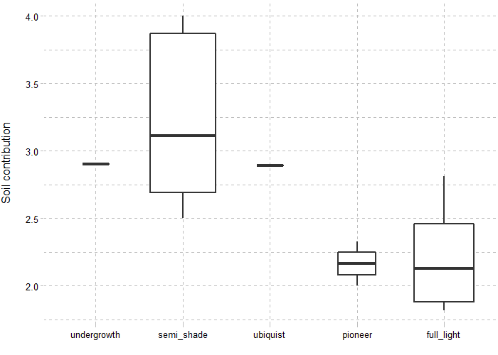</img>
</div>

<br/><br/>


### 3. Running a `FATE` simulation

```R
library(RFate)

## Select a parameter file
param = "Simul_parameters_V1.1.txt"
# param = "Simul_parameters_V2.1.txt"
# param = "Simul_parameters_V3.1.txt"
# param = "Simul_parameters_V4.1.txt"

## Run the simulation
## (here parallelized on 4 resources, and showing only warning and error messages)
FATE(simulParam = paste0("FATE_Champsaur/PARAM_SIMUL/", param)
     , no_CPU = 4
     , verboseLevel = 2)
```

#### Explore, understand and tune the parameters

<br/>

When using the **Light module**, the `LIGHT_THRESH_MEDIUM` and `LIGHT_THRESH_LOW` parameters will depend on the PFG abundances within a pixel. *For example, a simulation in which a pixel will contain 5 or 6 PFG, each with a maximum total abundance around 5000, will have different parameter values than a simulation in which a pixel will contain 10 PFG with a maximum total abundance set to 1000.*

In the same way, these parameters can change depending on the module activated. *Here, the values of `LIGHT_THRESH_MEDIUM` and `LIGHT_THRESH_LOW` change between the simulations 2 (**only Light**) and 4 (**Light + Soil**).*

```R
## --------------------------------------------------------------------------------------
## This code calculates for each PFG its maximum total abundance :
##   MaxAbund * (1 + ImmSize)

# ma_low = .getParam(params.lines = "FATE_Champsaur/DATA/GLOBAL_PARAMETERS/Global_parameters_V1.txt"
#                    , flag = "MAX_ABUND_LOW", flag.split = " ", is.num = TRUE)
# ma_med = .getParam(params.lines = "FATE_Champsaur/DATA/GLOBAL_PARAMETERS/Global_parameters_V1.txt"
#                    , flag = "MAX_ABUND_MEDIUM", flag.split = " ", is.num = TRUE)
# ma_hig = .getParam(params.lines = "FATE_Champsaur/DATA/GLOBAL_PARAMETERS/Global_parameters_V1.txt"
#                    , flag = "MAX_ABUND_HIGH", flag.split = " ", is.num = TRUE)
# tab = as.data.frame(fread("FATE_Champsaur/DATA/PFGS/SUCC_COMPLETE_TABLE.csv"))
# tab = tab[, c("NAME", "HEIGHT", "LONGEVITY", "MATURITY", "MAX_STRATUM", "MAX_ABUNDANCE", "IMM_SIZE")]
# tab$maxi_mat = sapply(tab$MAX_ABUNDANCE, function(x) switch(x, "1" = ma_low, "2" = ma_med, "3" = ma_hig))
# tab$maxi_tot = tab$maxi_mat * (1 + tab$IMM_SIZE / 10)
# head(tab)
```

<div style="text-align:center;">
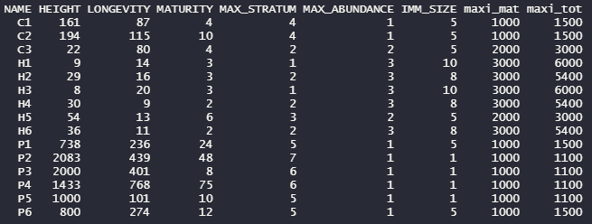</img>
</div>

<br/>

When using the **Soil module**, the ranges of soil tolerance (`SOIL_LOW` and `SOIL_HIGH`) of all PFG should overlap in a balanced way : not too much, otherwise no effect of the soil module will be seen, but enough to ensure PFG survival.

<div style="text-align:center;">
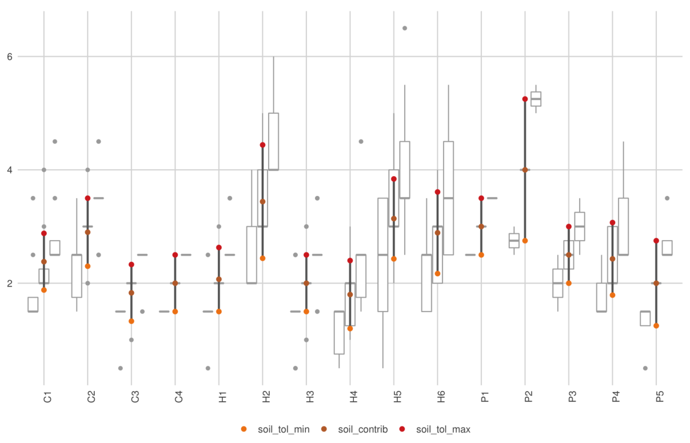</img>
</div>

<br/><br/>


In any case, it is good to keep in mind that **it does not exist ONE good parametrization, but rather a gradient of parameter values** along which more or less effect will be seen. <br/>
*For example, Light module can be activated, but if the thresholds are well above pixel abundances, it will have no impact on the communities. As the thresholds are lowered, the interaction for light will become increasingly important, leading at some point to the crash of some PFG.*


<br/><br/>


### 4. Analyzing results


```R
## .loadData("Champsaur_results", "7z") :
##    table outputs and graphic pdf files only


library(RFate)

## Select a parameter file
param = "Simul_parameters_V1.1.txt"
# param = "Simul_parameters_V2.1.txt"
# param = "Simul_parameters_V3.1.txt"
# param = "Simul_parameters_V4.1.txt"

simul.name = "FATE_Champsaur"
simul.param = paste0("FATE_Champsaur/PARAM_SIMUL/", param)


###################################################################################################
## TEMPORAL EVOLUTION
###################################################################################################

POST_FATE.temporalEvolution(name.simulation = simul.name
                            , file.simulParam = simul.param
                            , no_years = 40)

POST_FATE.graphic_evolutionCoverage(name.simulation = simul.name
                                    , file.simulParam = simul.param)

POST_FATE.graphic_evolutionPixels(name.simulation = simul.name
                                  , file.simulParam = simul.param)

POST_FATE.graphic_evolutionStability(name.simulation = simul.name
                                     , file.simulParam = simul.param)


###################################################################################################
## RELATIVE ABUNDANCE / BINARY MAPS & VALIDATION
###################################################################################################

Champsaur_params = .loadData("Champsaur_params", "RData")

## PFG observations
tab.occ = Champsaur_params$tab.occ
tab.xy = Champsaur_params$tab.xy

## Merge observations and sites coordinates
tab.obs = merge(tab.occ, tab.xy, by = "row.names")
tab.obs = melt(tab.obs, id.vars = c("Row.names", "X", "Y"))
colnames(tab.obs) = c("sites", "X", "Y", "PFG", "obs")
tab.obs = na.exclude(tab.obs)
head(tab.obs)


POST_FATE.relativeAbund(name.simulation = simul.name
                        , file.simulParam = simul.param
                        , years = 2000)

POST_FATE.graphic_validationStatistics(name.simulation = simul.name
                                       , file.simulParam = simul.param
                                       , years = 2000
                                       , mat.PFG.obs = tab.obs[, c("PFG", "X", "Y", "obs")])

POST_FATE.binaryMaps(name.simulation = simul.name
                     , file.simulParam = simul.param
                     , years = 2000
                     , method = 1
                     , method1.threshold = 0.05)

POST_FATE.graphic_mapPFGvsHS(name.simulation = simul.name
                             , file.simulParam = simul.param
                             , years = 2000)


###################################################################################################
## VISUALIZATION OF OUTPUTS
###################################################################################################

POST_FATE.graphic_mapPFG(name.simulation = simul.name
                         , file.simulParam = simul.param
                         , years = 2000
                         , opt.stratum_min = 1
                         , opt.stratum_max = 6)

```

<br/>

The [evolutionCoverage](./../reference/POST_FATE.graphic_evolutionCoverage.html) graphic allows a *rapid evaluation of the presence and the importance of PFG* at the end of the simulation. <br/>
The [mapPFG](./../reference/POST_FATE.graphic_mapPFG.html) graphics give *spatial representations*. <br/>
The [evolutionPixels](./../reference/POST_FATE.graphic_evolutionPixels.html) can help understand the *dynamics between different modules when selecting the same pixels*.


<div style="text-align:center;">
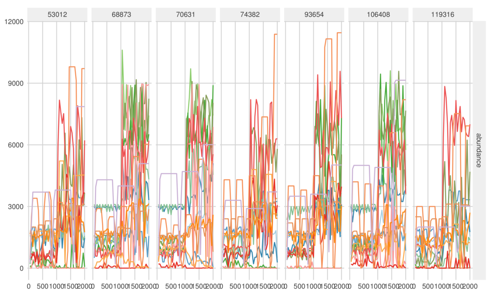</img>
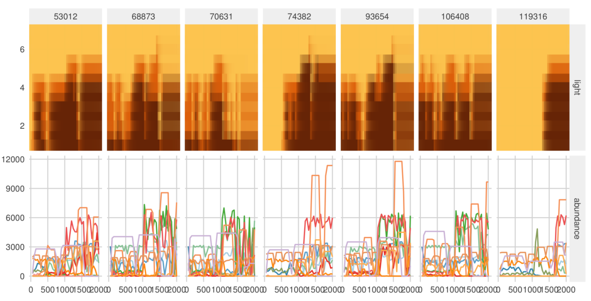</img>
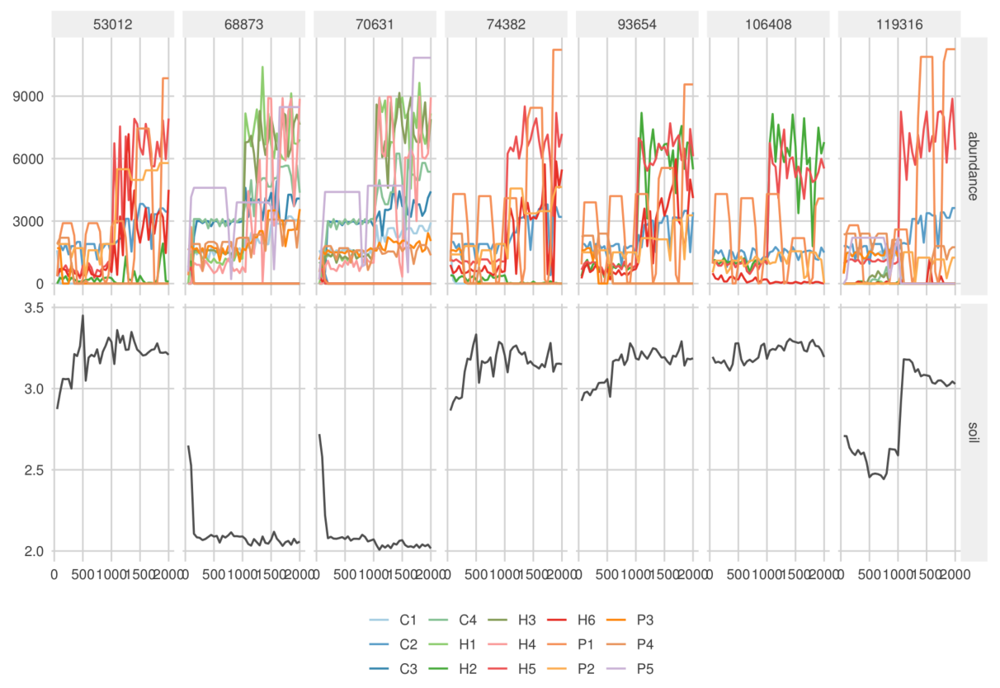</img>
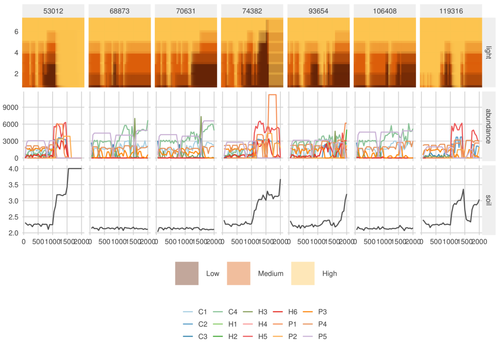</img>
</div>


<br/>


