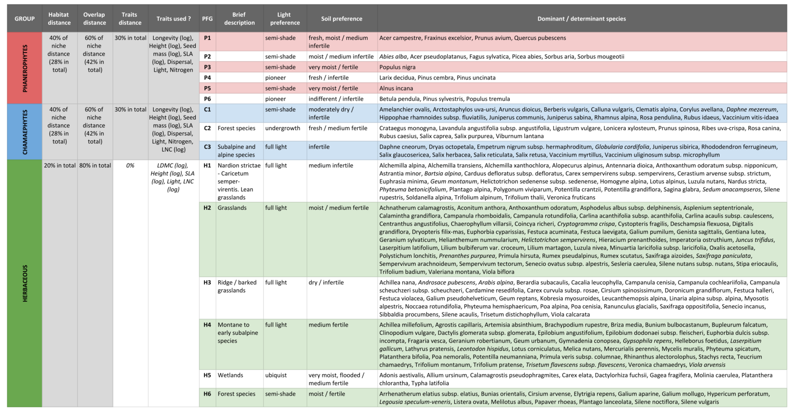

<link rel="stylesheet" href="https://use.fontawesome.com/releases/v5.0.13/css/all.css" integrity="sha384-DNOHZ68U8hZfKXOrtjWvjxusGo9WQnrNx2sqG0tfsghAvtVlRW3tvkXWZh58N9jp" crossorigin="anonymous">

<style>
.zoom p {
width:600px;
margin-left: auto;
margin-right: auto;
}
.zoom p:hover {
width:1200px;
}
</style>


<br/><br/>


## <i class="fas fa-book-medical"></i> Manual (Version 1.0.0)

More informations about the Champsaur example dataset can be found [here](./../reference/dot-loadData.html).


<br/><br/>


## <i class="fas fa-code"></i> Complete code example

The different parts of the Champsaur example dataset can be downloaded with the [.loadData](./../reference/dot-loadData.html) function, or from the links below :

- Champsaur PFG : &emsp;&emsp; <a href="https://raw.githubusercontent.com/leca-dev/RFate/master/data-raw/Champsaur_PFG.RData" class="download" title="Download as RData"><i class="fas fa-download"></i> `RData`</a> &emsp;&emsp; <a href="https://raw.githubusercontent.com/leca-dev/RFate/master/data-raw/Champsaur_PFG.7z" class="download" title="Download as 7z"><i class="fas fa-download"></i> `7z`</a>
- Champsaur params : &emsp;&emsp; <a href="https://raw.githubusercontent.com/leca-dev/RFate/master/data-raw/Champsaur_params.RData" class="download" title="Download as RData"><i class="fas fa-download"></i> `RData`</a> &emsp;&emsp; <a href="https://raw.githubusercontent.com/leca-dev/RFate/master/data-raw/Champsaur_params.7z" class="download" title="Download as 7z"><i class="fas fa-download"></i> `7z`</a>


### 1. Building Plant Functional Group

```R
library(RFate)

Champsaur_PFG = .loadData("Champsaur_PFG")


###################################################################################################
## DOMINANT SPECIES
###################################################################################################

## Species observations
tab.occ = Champsaur_PFG$sp.observations
str(tab.occ)

## Run selection ----------------------------------------------------------------------------------
sp.SELECT = PRE_FATE.selectDominant(mat.observations = tab.occ[, c("sites", "species", "abund")]
                                    , doRuleA = TRUE
                                    , rule.A1 = 10
                                    , rule.A2_quantile = 0.88
                                    , doRuleB = TRUE
                                    , rule.B1_percentage = 0.25
                                    , rule.B1_number = 10
                                    , rule.B2 = 0.5
                                    , doRuleC = FALSE
                                    , opt.doRobustness = TRUE
                                    , opt.robustness_percent = seq(0.1, 0.9, 0.1)
                                    , opt.robustness_rep = 10)

## Explore results
names(sp.SELECT)
str(sp.SELECT[1:5])
str(sp.SELECT$tab.rules)
plot(sp.SELECT$plot.A)
plot(sp.SELECT$plot.B$abs)
plot(sp.SELECT$plot.B$rel)
plot(sp.SELECT$plot.pco$Axis1_Axis2)
# plot(sp.SELECT$plot.pco$Axis1_Axis3)
str(sp.SELECT$tab.robustness)
names(sp.SELECT$plot.robustness)
plot(sp.SELECT$plot.robustness$`All dataset`)


## Prepare data to calculate pairwise species distance --------------------------------------------

# ## Calculate mat.overlap matrix
# ## Add absences for community sites
# tab.dom.PA = sp.SELECT$tab.dom.PA
# for (si in sites$sites[which(sites$TYPE == "COMMUNITY")])
# {
#   ind = which(rownames(tab.dom.PA) == si)
#   tab.dom.PA[ind, which(is.na(tab.dom.PA[ind, ]))] = 0
# }
# 
# ## Prepare environmental (and traits) table
# tab.env = Champsaur_PFG$tab.env
# tmp.traits = Champsaur_PFG$sp.traits[, c("species", "HEIGHT", "HEIGHT_log")]
# sp.DIST = PRE_FATE.speciesDistance(mat.traits = tmp.traits
#                                    , mat.overlap.option = "PCA"
#                                    , mat.overlap.object = list(tab.dom.PA, tab.env))
# mat.overlap = sp.DIST$mat.OVERLAP
# (mat.overlap[1:5, 1:5])

mat.habitat = Champsaur_PFG$mat.habitat
mat.overlap = Champsaur_PFG$mat.overlap

## Transform dissimilarity matrices into similarity distances
mat.habitat = 1 - mat.habitat
mat.overlap = 1 - mat.overlap

## Combine distances of habitat preferences and niche overlap
## to have one matrix to reflect the species niches
ind.sp = intersect(colnames(mat.overlap), colnames(mat.habitat))
wei.habi = 0.4
wei.over = 0.6
mat.env = (wei.habi * mat.habitat[ind.sp, ind.sp] + wei.over * mat.overlap[ind.sp, ind.sp]) / (wei.habi + wei.over)

(mat.habitat[ind.sp, ind.sp][1:5, 1:5])
(mat.overlap[ind.sp, ind.sp][1:5, 1:5])
(mat.env[1:5, 1:5])


tab.traits.P = sp.traits.P
tab.traits.C = sp.traits.C
tab.traits.H = sp.traits.H

str(tab.traits.P)
str(tab.traits.C)
str(tab.traits.H)
  


###################################################################################################
## PHANEROPHYTE
###################################################################################################

## Calculate pairwise species distance ------------------------------------------------------------
  
sp.DIST.P = PRE_FATE.speciesDistance(mat.traits = tab.traits.P
                                     , mat.overlap.option = "dist"
                                     , mat.overlap.object = mat.env
                                     , opt.weights = c(0.3, 0.7)
                                     , opt.maxPercent.NA = 0.25
                                     , opt.maxPercent.similarSpecies = 0.5
                                     , opt.min.sd = 0.5)
                                     
str(sp.DIST.P)
{
  require(foreach)
  require(ggplot2)
  require(ggdendro)
  pp = foreach(x = names(sp.DIST)) %do%
  {
    hc = hclust(sp.DIST[[x]])
    pp = ggdendrogram(hc, rotate = TRUE) +
      labs(title = paste0("Hierarchical clustering based on species distance "
                          , ifelse(length(names(sp.DIST)) > 1
                          , paste0("(group ", x, ")")
                          , "")))
    return(pp)
  }
  plot(pp[[1]])
  plot(pp[[2]])
  plot(pp[[3]])
}
                                     
## Build clusters and choose final groups number --------------------------------------------------
                                
sp.CLUST1.P = PRE_FATE.speciesClustering_step1(sp.DIST.P$mat.ALL)
sp.CLUST2.P = PRE_FATE.speciesClustering_step2(clust.dendrograms = sp.CLUST1.P$clust.dendrograms
                                               , no.clusters = 5
                                               , mat.species.DIST = sp.DIST.P$mat.ALL)

names(sp.CLUST2.P)
str(sp.CLUST2.P$determ.sp)
str(sp.CLUST2.P$determ.all)
plot(sp.DETERM$plot.distance)
plot(sp.DETERM$plot.PCO$Phanerophyte)


###################################################################################################
## CHAMAEPHYTE
###################################################################################################

## Calculate pairwise species distance ------------------------------------------------------------
  
sp.DIST.C = PRE_FATE.speciesDistance(mat.traits = tab.traits.C
                                     , mat.overlap.option = "dist"
                                     , mat.overlap.object = mat.env
                                     , opt.weights = c(0.3, 0.7)
                                     , opt.maxPercent.NA = 0.25
                                     , opt.maxPercent.similarSpecies = 0.5
                                     , opt.min.sd = 0.5)

## Build clusters and choose final groups number --------------------------------------------------
                                
sp.CLUST1.C = PRE_FATE.speciesClustering_step1(sp.DIST.C$mat.ALL)
sp.CLUST2.C = PRE_FATE.speciesClustering_step2(clust.dendrograms = sp.CLUST1.C$clust.dendrograms
                                               , no.clusters = 3
                                               , mat.species.DIST = sp.DIST.C$mat.ALL)


###################################################################################################
## HERBACEOUS
###################################################################################################

## Rearrange data (more difficult to distinguish groups among herbaceous species) -----------------

## Separate some species quite different from the rest
PFG_wetlands = c("15735", "15211", "10429", "17167", "40501", "16522", "40514", "14782", "40445")
tab.traits.H = tab.traits.H[-which(tab.traits.H$species %in% PFG_wetlands), ]
  
## Put more weights on niche overlap
ind.sp = intersect(colnames(mat.overlap), colnames(mat.habitat))
wei.habi = 0.2
wei.over = 0.8
mat.env = (wei.habi * mat.habitat[ind.sp, ind.sp] + wei.over * mat.overlap[ind.sp, ind.sp]) / (wei.habi + wei.over)

## Calculate pairwise species distance ------------------------------------------------------------
  
sp.DIST.H = PRE_FATE.speciesDistance(mat.traits = tab.traits.H
                                     , mat.overlap.option = "dist"
                                     , mat.overlap.object = mat.env
                                     , opt.weights = c(0, 1)
                                     , opt.maxPercent.NA = 0.25
                                     , opt.maxPercent.similarSpecies = 0.5
                                     , opt.min.sd = 0.5)
                                     
                                     
## Build clusters and choose final groups number --------------------------------------------------
                                
sp.CLUST1.H = PRE_FATE.speciesClustering_step1(sp.DIST.H$mat.ALL)
sp.CLUST2.H = PRE_FATE.speciesClustering_step2(clust.dendrograms = sp.CLUST1.H$clust.dendrograms
                                               , no.clusters = 7
                                               , mat.species.DIST = sp.DIST.H$mat.ALL)


###################################################################################################
## PLANT FUNCTIONAL GROUPS
###################################################################################################

tab.PFG = Champsaur_PFG$PFG.species

tab.traits = Champsaur_PFG$sp.traits
tab.summary = tab.traits[, c("species", "MATURITY", "LONGEVITY", "HEIGHT", "LIGHT"
                             , "DISPERSAL", "NITROGEN", "NITROGEN_TOLERANCE", "LDMC", "LNC")]
colnames(tab.summary) = c("species", "maturity", "longevity", "height", "light"
                          , "dispersal", "soil_contrib", "soil_tolerance", "LDMC", "LNC")
tab.summary$soil_contrib = as.numeric(tab.summary$soil_contrib)
tab.summary$soil_tolerance = ifelse(tab.summary$soil_tolerance == 1, 0.5, 1)
tab.summary = merge(tab.PFG[, c("PFG", "species")], tab.summary, by = "species", all.x = TRUE)
head(tab.summary)

## Calculate trait values per PFG -----------------------------------------------------------------

PFG.traits = PRE_FATE.speciesClustering_step3(mat.traits = tab.summary)

```


<br/><br/>

A brief description of the Plant Functional Groups obtained for the Champsaur dataset is presented below. *italic* represents species that have been pointed out as `Not determinant` by the [PRE_FATE.speciesClustering_step2](./../reference/PRE_FATE.speciesClustering_step2.html) function (*difference between dominant and determinant species is explained in the [Details](./../reference/PRE_FATE.speciesClustering_step2.html#details) section of this function*), but in this example they have all been kept for consistency in concerned PFG.

<div class="zoom">
<p></img></p>
</div>

<br/><br/>

### 2. Creating `FATE` parameter files

```R
library(RFate)

Champsaur_params = .loadData("Champsaur_params")


###################################################################################################
## BUILD PFG HABSUIT MAPS (biomod2 package)
###################################################################################################

require(biomod2)

## Species observations
tab.occ = Champsaur_params$tab.occ
str(tab.occ)

## Sites environmental table
tab.env = Champsaur_params$tab.env
str(tab.env)

## Sites coordinates table
tab.xy = Champsaur_params$tab.xy
str(tab.xy)

## Raster stack for projection
stk.var = Champsaur_params$stk.var

## Run species distribution models ----------------------------------------------------------------

for(pfg in colnames(tab.occ))
{
  nrep = 5
  sp.name = pfg
  sp.occ = tab.occ[which(!is.na(tab.occ[, pfg])), pfg]
  sp.xy = tab.xy[which(!is.na(tab.occ[, pfg])), c("X", "Y")]
  sp.var = tab.env[which(!is.na(tab.occ[, pfg])), ]
  
  #########################################################################################
  ## BELOW, MOST CHANGES WILL BE FOR MODELS PARAMETERS OR ADAPT DATA
  ## ALL NEEDED DATA HAS BEEN PRESENTED PREVIOUSLY
  
  ## formating data in a biomod2 friendly way ------------------------------------
  bm.form <- BIOMOD_FormatingData(resp.var = as.matrix(sp.occ)
                                  , expl.var = sp.var
                                  , resp.xy = sp.xy
                                  , resp.name = sp.name)
  
  ## define models options -------------------------------------------------------
  bm.opt <- BIOMOD_ModelingOptions(GLM = list(type = "quadratic", interaction.level = 0, test = "AIC")
                                   , GAM = list(k = 3))
  
  bm.mod <- BIOMOD_Modeling(data = bm.form
                            , models = c('RF', 'GLM', 'GAM')
                            , models.options = bm.opt
                            , NbRunEval = nrep
                            , DataSplit = 70
                            , Prevalence = 0.5
                            , VarImport = 3
                            , models.eval.meth = c('TSS','ROC')
                            , do.full.models = FALSE
                            , modeling.id = 'mod1')
  
  ## run ensemble models ---------------------------------------------------------
  bm.em <- BIOMOD_EnsembleModeling(modeling.output = bm.mod
                                   , chosen.models = "all"
                                   , em.by = "all"
                                   , eval.metric = c('TSS')
                                   , eval.metric.quality.threshold = 0.4
                                   , models.eval.meth = c('TSS', 'ROC')
                                   , prob.mean = FALSE
                                   , prob.mean.weight = TRUE
                                   , prob.mean.weight.decay = 'proportional'
                                   , committee.averaging = TRUE
                                   , VarImport = 3)
  
  ## project ensemble models -----------------------------------------------------
  bm.ef <- BIOMOD_EnsembleForecasting(EM.output = bm.em
                                      , new.env = stk.var
                                      , output.format = ".img"
                                      , proj.name = "CURRENT_100m"
                                      , selected.models = "all"
                                      , binary.meth = c('TSS'))
}


###################################################################################################
## CREATE FATE PARAMETER FOLDER
###################################################################################################

PRE_FATE.skeletonDirectory(name.simulation = "FATE_Champsaur")


## Create PFG parameter files ---------------------------------------------------------------------

## SUCCESSION ---------------------------------------------------------------------------
PRE_FATE.params_PFGsuccession(name.simulation = "FATE_Champsaur"
                              , strata.limits = c(0, 20, 50, 150, 400, 1000, 2000)
                              , strata.limits_reduce = FALSE
                              , mat.PFG.succ = Champsaur_params$tab.SUCC)


## DISPERSAL ----------------------------------------------------------------------------
# ## Load example data
# Champsaur_PFG = .loadData("Champsaur_PFG")
#
# ## Build PFG traits for dispersal
# tab.traits = Champsaur_PFG$PFG.traits
# ## Dispersal values
# ##   = Short: 0.1-2m;    Medium: 40-100m;    Long: 400-500m
# ##   = Vittoz correspondance : 1-3: Short;    4-5: Medium;   6-7:Long
# corres = data.frame(dispersal = 1:7
#                     , d50 = c(0.1, 0.5, 2, 40, 100, 400, 500)
#                     , d99 = c(1, 5, 15, 150, 500, 1500, 5000)
#                     , ldd = c(1000, 1000, 1000, 5000, 5000, 10000, 10000))
# tab.traits$d50 = corres$d50[tab.traits$dispersal]
# tab.traits$d99 = corres$d99[tab.traits$dispersal]
# tab.traits$ldd = corres$ldd[tab.traits$dispersal]
# str(tab.traits)

PRE_FATE.params_PFGdispersal(name.simulation = "FATE_Champsaur"
                             , mat.PFG.disp = Champsaur_params$tab.DISP)


## LIGHT --------------------------------------------------------------------------------
PRE_FATE.params_PFGlight(name.simulation = "FATE_Champsaur"
                         , mat.PFG.light = Champsaur_params$tab.LIGHT[, c("PFG", "type")]
                         , mat.PFG.tol = Champsaur_params$tab.LIGHT[, c("PFG", "strategy_tol")])


## SOIL ---------------------------------------------------------------------------------
PRE_FATE.params_PFGsoil(name.simulation = "FATE_Champsaur"
                        , mat.PFG.soil = Champsaur_params$tab.SOIL)


## DISTURBANCE --------------------------------------------------------------------------
require(data.table)
tmp = fread("FATE_Champsaur/DATA/PFGS/SUCC_COMPLETE_TABLE.csv")
tab.succ = Champsaur_params$tab.SUCC
tab.succ$age_above_150cm = tmp$CHANG_STR_AGES_to_str_4_150

PRE_FATE.params_PFGdisturbance(name.simulation = "FATE_Champsaur"
                               , mat.PFG.dist = tab.succ
                               , mat.PFG.tol = Champsaur_params$tab.DIST)


## Create simulation related parameter files ------------------------------------------------------

## CHANGING TIMES -----------------------------------------------------------------------
tab.changing = data.frame(year = c(600, 601, 800, 801)
                          , order = rep(1, 4)
                          , new.value = c("MASK_mowing.img"
                                          , "MASK_noDisturb.img"
                                          , "MASK_mowing.img"
                                          , "MASK_noDisturb.img"))

PRE_FATE.params_changingYears(name.simulation = "FATE_Champsaur"
                              , type.changing = "DIST"
                              , mat.changing = tab.changing)


## SAVING YEARS -------------------------------------------------------------------------
PRE_FATE.params_savingYears(name.simulation = "FATE_Champsaur"
                            , years.maps = seq(10, 1000, 10))


## GLOBAL PARAMS ------------------------------------------------------------------------
combi = expand.grid(doLight = c(FALSE, TRUE), doSoil = c(FALSE, TRUE))
for (ii in 1:nrow(combi))
{
  PRE_FATE.params_globalParameters(name.simulation = "FATE_Champsaur"
                                   , opt.saving_abund_PFG_stratum = TRUE
                                   , opt.saving_abund_PFG = TRUE
                                   , opt.saving_abund_stratum = FALSE
                                   , required.no_PFG = 15
                                   , required.no_strata = 7
                                   , required.simul_duration = 1000
                                   , required.seeding_duration = 300
                                   , required.seeding_timestep = 1
                                   , required.seeding_input = 100
                                   , required.potential_fecundity = 10
                                   , required.max_abund_low = 100
                                   , required.max_abund_medium = 200
                                   , required.max_abund_high = 500
                                   , doLight = combi$doLight[ii]
                                   , LIGHT.thresh_medium = 400
                                   , LIGHT.thresh_low = 600
                                   , LIGHT.saving = TRUE
                                   , doSoil = combi$doSoil[ii]
                                   , SOIL.init = 2.5
                                   , SOIL.retention = 0.8
                                   , SOIL.saving = TRUE
                                   , doDispersal = TRUE
                                   , DISPERSAL.mode = 1
                                   , DISPERSAL.saving = FALSE
                                   , doHabSuitability = TRUE
                                   , HABSUIT.mode = 1
                                   , doDisturbances = TRUE
                                   , DIST.no = 1
                                   , DIST.no_sub = 4
                                   , DIST.freq = 1)
}


## SIMUL_PARAM --------------------------------------------------------------------------
writeRaster(Champsaur_params$stk.mask
            , filename = paste0("FATE_Champsaur/DATA/MASK/MASK_"
                                , names(Champsaur_params$stk.mask), ".img")
            , bylayer = TRUE)
writeRaster(Champsaur_params$stk.wmean
            , filename = paste0("FATE_Champsaur/DATA/PFGS/HABSUIT/HS_"
                                , names(Champsaur_params$stk.wmean), "_0.img")
            , bylayer = TRUE)
            
.adaptMaps(name.simulation = "FATE_Champsaur", extension.old = "img", extension.new = "img")

file.remove(list.files(path = paste0("FATE_Champsaur/DATA/MASK/")
                       , pattern = ".img.aux.xml$", full.names = TRUE))
file.remove(list.files(path = paste0("FATE_Champsaur/DATA/PFGS/HABSUIT/")
                       , pattern = ".img.aux.xml$", full.names = TRUE))

PRE_FATE.params_simulParameters(name.simulation = "FATE_Champsaur"
                                , name.MASK = "MASK_Champsaur.img"
                                , name.DIST = "MASK_noDisturb.img")

```

### 3. Running a `FATE` simulation

pif

### 4. Analyzing results

paf

<br/><br/>


